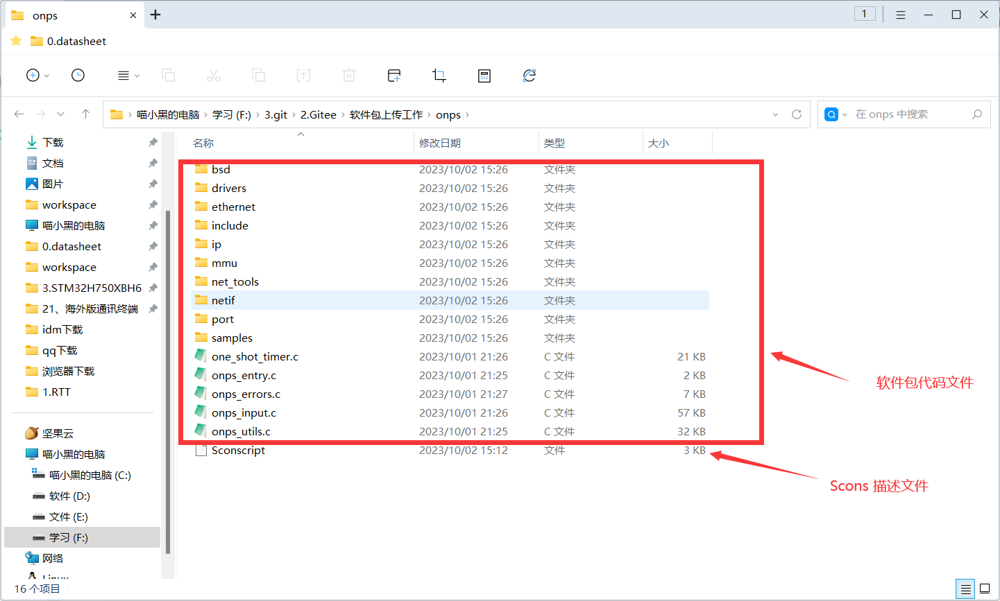
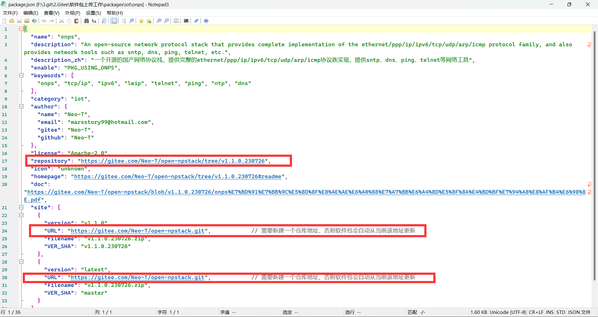
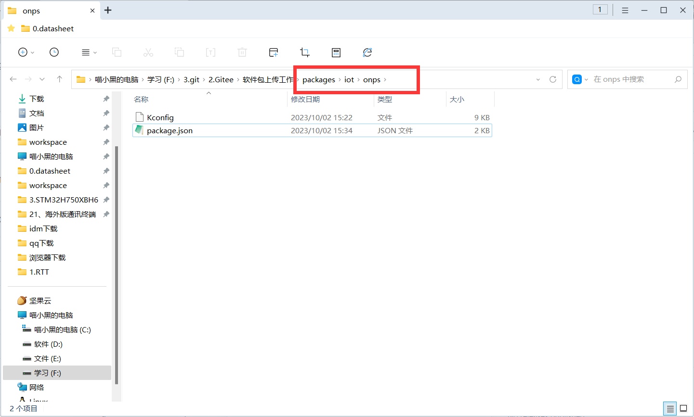
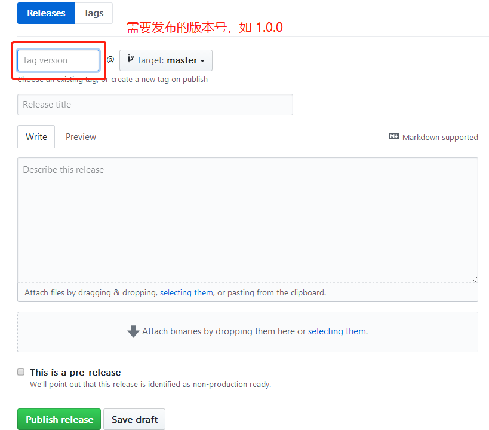

# 参考文档

[软件包开发指南 (rt-thread.org)](https://www.rt-thread.org/document/site/#/rt-thread-version/rt-thread-standard/development-guide/package/package)

[软件包索引仓库](https://github.com/RT-Thread/packages)

# 1 软件包

软件包结构如下，主要分为**软件包代码文件**和一个 **Scons 脚本文件**。

我们需要新建一个该软件包的**仓库**，并将其地址更新于 **package.json** 文件中（见下文）。

## 注意

[RT-Thread/packages: packages index repository for rt-thread (github.com)](https://github.com/RT-Thread/packages)

1. 提交前请确认Kconfig以及package.json文件的编码格式为UTF-8格式，否则会导致env报错。
2. 软件包的仓库名称不要以数字开头，否则gitee备份中国大陆镜像源时，备份不过去。
3. 软件包内请不要包含submodule，gitee中国大陆镜像源无法备份submodule的内容，会导致用户直接使用github拉取软件包，可能会断流。
4. 需要采用github作为软件包托管仓库，不要使用gitee，后台会自动创建gitee大陆镜像源。
5. 在你的软件包索引被合并之后，请于次日或后日到[RTT软件包中国gitee镜像源组织](https://gitee.com/RT-Thread-Mirror)中查看是否增加了你的软件包仓库（每日凌晨会有机器人自动同步），如果没有增加和同步，请在github提issue与管理员联系。
6. 可以在提交之前使用vscode或者是json语法检查工具检查json的语法是否正确，以免引发自检机器人报错
7. 如果是将第三方设计的开源项目注册到RT-Thread软件包中心，尽量fork该项目（也称之为上游项目），方便日后同步上游修改，[例如](https://github.com/flyingcys/rpmsg-lite)。或者如果上游项目同意添加RT-Thread的Sconscript，可以直接将上游项目直接注册为RT-Thread软件包，[例如](https://github.com/lvgl/lvgl)

# 2 软件包索引

Fork [RT-Thread/packages: packages index repository for rt-thread (github.com)](https://github.com/RT-Thread/packages)

在下图路径中，添加 package.json 文件和 Kconfig 文件，用于提供 **软件包基本信息** 和 **项目配置信息**。

在 **第一步** 完成后，PR 软件包索引。

其中，Kconfig 的配置遵循以下原则：

- 索引向导自动生成的 **Kconfig** 文件中的内容大多是必须的，可以参考其他软件包修改选项的值，但是**不要删除选项**。
- 软件包必须包含一个以`PKG_USING_`开头的配置项，这样RT-Thread的包管理器才能将其正确识别。假设这个包的名称叫做SOFTA，那么软件包总选项应该是`PKG_USING_SOFTA`；
- 和这个SOFTA软件包相关的其他选项，需要以`SOFTA_`开头的配置项进行定义，可以是`SOFTA_USING_A`或者`SOFTA_ENABLE_A`等方式。
- 支持 **latest** 版本的软件包也至少需要一个固定版本，以防止在某个时候找不到合适的版本。
- 软件包如果还需要更多的配置项，可以搜索 **Kconfig 语法** ，并参考已有的软件包来对 Kconfig 文件进行修改。

# 3 软件包发布

软件包发布新版本需要遵循以下流程：

1、检查软件包，确保软件包功能使用正常。

2、在 github 上使用 release 功能发布新版本，如果没有权限可以通知管理员发布新版本。如果不知道该如何 release，可以参考 [paho-mqtt 软件包仓库](https://github.com/RT-Thread-packages/paho-mqtt/releases)，发布新版本界面如下所示：

3、修改本地软件包索引，在 kconfig 文件和 package.json 文件中添加新版本的信息。

4、在本地测试新版本软件包的下载和删除，以及安装是否正常，确保软件包可以被正常添加到工程中使用。

5、向[软件包索引](https://github.com/RT-Thread/packages)提交 PR，并通知管理员合并。